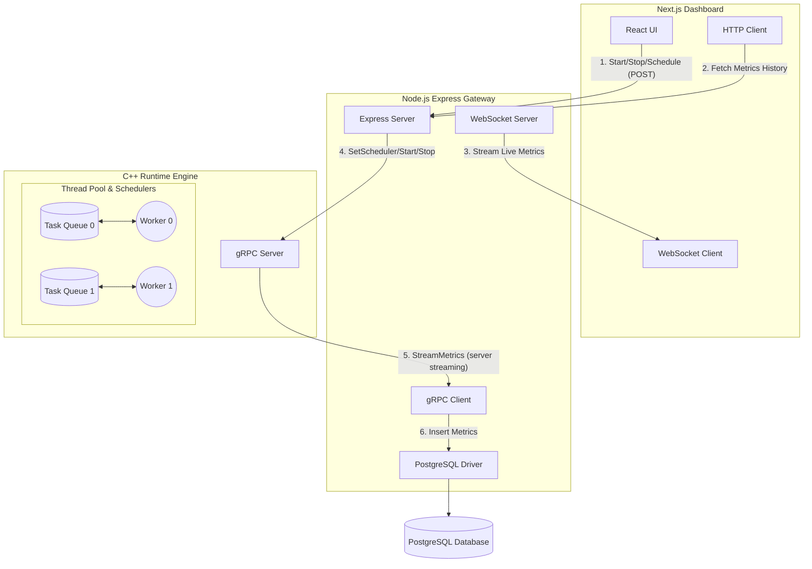

# HelixRT 🚀

HelixRT is a high-performance distributed systems runtime observability project, simulating a conceptual operating system task scheduler. Built to demonstrate thread pooling, task stealing, multi-modal scheduling, and real-time remote telemetry.

## Architecture Diagram



## Features

1. **Thread Pool Runtime**: Custom C++ implementation with work stealing.
2. **gRPC Streaming**: Bi-directional communication between the Node Gateway and C++ Backend.
3. **Metrics Collection**: Real-time throughput, latency, queue depth, and thread utilization tracking.
4. **Database Storage**: Historical persistence of execution state in PostgreSQL.
5. **WebSocket Broadcasting**: Pushing real-time UI updates to Next.js clients.
6. **Live Dashboard**: Interactive React frontend utilizing Recharts and real-time alerts.
7. **Runtime Control**: Start/Stop the C++ metrics telemetry remotely.
8. **Pluggable Schedulers**: Change the execution task-pull strategy at runtime.
9. **Dockerized Deployment**: Fully containerized environment for quick spin-up.

---

## Scheduler Design

HelixRT features a dynamic scheduler that allows the C++ execution engine to change how worker threads extract tasks from their concurrent queues.

- **FIFO (First-In, First-Out)**: The default behavior. Workers pull the oldest tasks from the front of their respective queues.
- **Round Robin (Work Stealing)**: Instead of only looking at their own queue, workers iterate through all queues in the system in a circular fashion and take tasks from wherever they can find them, achieving maximum throughput and load balancing.
- **Priority (LIFO)**: A simulated youngest-first approach where workers pull from the back of the queue.

---

## Setup Guide

There are two main ways to run this project: **Locally** and using **Docker**.

### 1. Docker Deployment (Recommended)

To run the entire stack (Database, C++ Runtime, Node Gateway, Next.js Frontend) in one command:

```bash
docker-compose up --build
```
*The Dashboard will be available at `http://localhost:3000/dashboard`*

### 2. Local Setup 

**Prerequisites**:
- CMake and a recent C++ compiler
- Protocol Buffers and gRPC
- Node.js >18
- PostgreSQL

**Step 1: Database Setup**
```bash
psql -U postgres -f init-db.sql
```

**Step 2: Start C++ Runtime**
```bash
cd apps/runtime
mkdir -p build && cd build
cmake ..
make
./runtime
```

**Step 3: Start Node API Gateway**
```bash
cd apps/gateway
npm install
npm run start
```

**Step 4: Start Next.js Frontend**
```bash
cd apps/frontend
npm install
npm run dev
```

Navigate to `http://localhost:3000/dashboard`!
