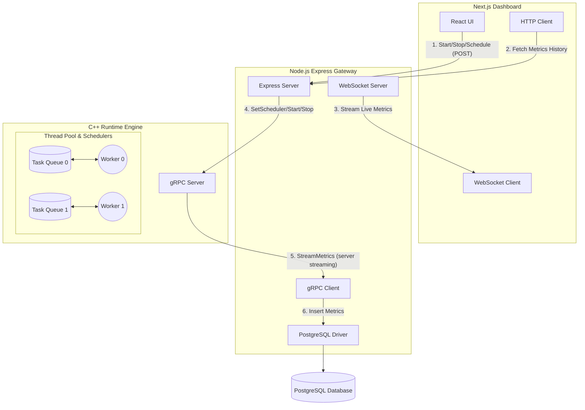

# HelixRT 🚀

HelixRT is a high-performance distributed systems runtime observability project, simulating a conceptual operating system task scheduler. Built to demonstrate thread pooling, task stealing, multi-modal scheduling, and real-time remote telemetry.

## Architecture Diagram



## Features

1. **Thread Pool Runtime**: Custom C++ implementation with work stealing.
2. **gRPC Streaming**: Bi-directional communication between the Node Gateway and C++ Backend.
3. **Metrics Collection**: Real-time throughput, latency, queue depth, and thread utilization tracking.
4. **Database Storage**: Historical persistence of execution state in PostgreSQL.
5. **WebSocket Broadcasting**: Pushing real-time UI updates to Next.js clients.
6. **Live Dashboard**: Interactive React frontend utilizing Recharts and real-time alerts.
7. **Runtime Control**: Start/Stop the C++ metrics telemetry remotely.
8. **Pluggable Schedulers**: Change the execution task-pull strategy at runtime.
9. **Dockerized Deployment**: Fully containerized environment for quick spin-up.
10. **Product Tour**: Interactive guided tour of the dashboard features.
11. **Blog Engine**: Dynamic routing for technical articles and documentation.

---

## Scheduler Design

HelixRT features a dynamic scheduler that allows the C++ execution engine to change how worker threads extract tasks from their concurrent queues.

- **FIFO (First-In, First-Out)**: The default behavior. Workers pull the oldest tasks from the front of their respective queues.
- **Round Robin (Work Stealing)**: Instead of only looking at their own queue, workers iterate through all queues in the system in a circular fashion and take tasks from wherever they can find them, achieving maximum throughput and load balancing.
- **Priority (LIFO)**: A simulated youngest-first approach where workers pull from the back of the queue.

---

## Setup Guide

There are two main ways to run this project: **Locally** and using **Docker**.

### 1. Docker Deployment (Recommended)

**Prerequisites:**
- [Docker Engine or Docker Desktop](https://docs.docker.com/get-docker/) installed.
- Docker Compose installed (usually included in Docker Desktop).

To run the entire stack (Database, C++ Runtime, Node Gateway, Next.js Frontend) in one command:

```bash
docker compose up --build
```
*Note: The first time you run this, it will build the containers and initialize the PostgreSQL database automatically.*

**Access the Applications:**
* Next.js Dashboard: `http://localhost:3000/dashboard`
* Next.js Blog: `http://localhost:3000/blog`

To stop the servers and clean up:
```bash
docker compose down -v
```

---

### 2. Local Setup 

**Prerequisites**:
- [Node.js](https://nodejs.org/) (v18 or higher)
- [PostgreSQL](https://www.postgresql.org/download/)
- CMake and a recent C++ compiler (GCC/Clang)
- Protocol Buffers & gRPC C++ libraries installed on your system

**Step 1: Database Setup**
First, you need to create the database in PostgreSQL before running the initialization script:
```bash
# Create the database
psql -U postgres -c "CREATE DATABASE helixrt;"

# Run the schema initialization script
psql -U postgres -f init-db.sql
```

**Step 2: Start C++ Runtime Engine**
This process runs on `localhost:50051`.
```bash
cd apps/runtime
mkdir -p build && cd build
cmake ..
make
./runtime
```

**Step 3: Start Node API Gateway**
This process connects to the database, exposes a REST/WebSocket API on `localhost:4000` & `8080`, and connects to the C++ gRPC Runtime.
```bash
cd apps/gateway
npm install
npm run start
```

**Step 4: Start Next.js Frontend**
```bash
cd apps/frontend
npm install
npm run dev
```

Navigate to `http://localhost:3000/dashboard` or `http://localhost:3000/blog`!

---

## ☁️ Free Cloud Deployment Guide

You can deploy the entire HelixRT stack for free using **Neon**, **Render**, and **Vercel**.

### Step 1: Database (Neon)
1. Sign up at [Neon.tech](https://neon.tech).
2. Create a new project named `helixrt`.
3. Copy the **Connection String** (it starts with `postgresql://...`).
4. In the Neon Console, go to **SQL Editor** and paste the contents of [init-db.sql](file:///home/sujon/projects/HelixRT/init-db.sql) to set up the schema.

### Step 2: Backend (Render)
1. Sign up at [Render.com](https://render.com).
2. Click **New** > **Blueprint**.
3. Connect your GitHub repository.
4. Render will detect the `render.yaml` file and prepare to deploy:
   - `helixrt-runtime` (C++ Engine)
   - `helixrt-gateway` (Node.js API)
5. During setup, Render will ask for the `DATABASE_URL` environment variable. Paste the connection string you copied from Neon.
6. Once deployed, copy your Gateway's URL (e.g., `https://helixrt-gateway.onrender.com`).

### Step 3: Frontend (Vercel)
1. Sign up at [Vercel.com](https://vercel.com).
2. Click **Add New** > **Project** and import your GitHub repository.
3. In the **Environment Variables** section, add:
   - `NEXT_PUBLIC_GATEWAY_URL`: `https://your-gateway-url.onrender.com`
   - `NEXT_PUBLIC_WS_URL`: `wss://your-gateway-url.onrender.com` (replace `https://` with `wss://`)
4. Click **Deploy**.

**Congratulations! Your real-time observability platform is live!**
